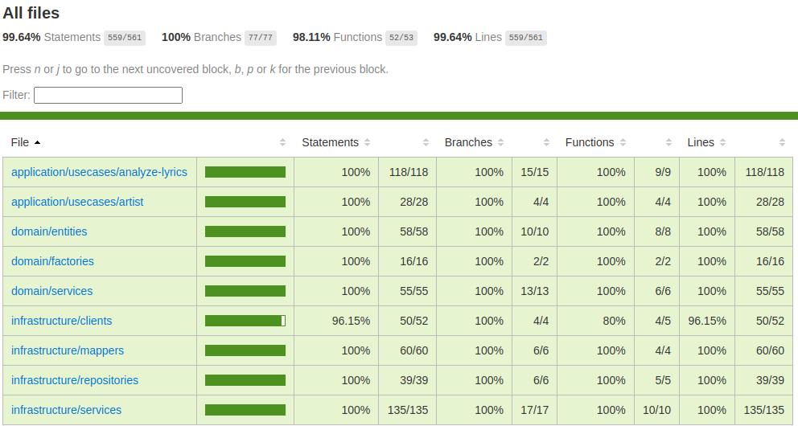

# Lyrics Analyzer

[[toc]]

## Introduction

> After several unsuccessful attempts to weld my results together into
> such a whole, I realized that I should never succeed. The best that I
> could write would never be more than philosophical remarks; my
> thoughts were soon crippled if I tried to force them on in any single
> direction against their natural inclination.
> [...]
> I should have liked to produce a good book. This has not come about, but the time is past in which I could improve it.

> *Ludwig Wittgenstein* on his impending deadline. The deadest of lines as far as deadlines go as he passed away shortly after writing this.

::: info
The songs are meant to provide comic relief during the reading of this semi-coherent rambling.
Yes there's an album, and yes you should listen to it before proceeding.
Not because it has anything to do with this text but because it's a really good album.
:::

<iframe style="border-radius:12px" src="https://open.spotify.com/embed/track/7fXPWrFoxtEGnoxu67ZjQa?utm_source=generator&theme=0" width="100%" height="152" frameBorder="0" allowfullscreen="" allow="autoplay; clipboard-write; encrypted-media; fullscreen; picture-in-picture" loading="lazy"></iframe>

Hip Hop music and me starting my journey as a programmer are connected through a peculiar link which I would like to expand on before getting into the gritty details of this project resulting from a chain of events that were set in motion more than a decade ago.

I've been a big fan of Hip Hop music ever since discovering Eminem when I was around 10 years old.
I still remember listening to his first albums on my CD player while diligently reading the lyrics to every song until I had memorized entire albums by heart - a habit I still have to this day.
At the time, I was far from being a proficient English speaker, so I had to look up a lot of the words and even knew some only by their phonetics.
I don't quite know what it was, but something had sparked my interest in both the English language and lyrics in general. Some years later, after having finished school, after having discovered plentiful other artists and after having gone through the same process of obsessing over their work, I found a [website](https://pudding.cool/projects/vocabulary/index.html) ranking rappers by their vocabulary.


Lo and behold, my favorite rapper at the time, Aesop Rock, was at the top of the list with a whooping 7,879 unique words used throughout his songs. If you know you know - no surprises there. However, some of the artists I was listening to at the time didn't appear at all.
Consequently, I did the only thing any reasonable person with a little too much time on their hands would do: I started to learn Python, the goal being to write a [script](https://github.com/4350pChris/LyricAnalyzer) to scrape the lyrics of artists I was listening to and run the same analysis on them.
During that time I realized - I really dig programming.

The project I will be talking about is my attempt at rewriting the aforementioned script in a more modern fashion, using the tools I have learned over the past few years.
Who would've guessed that a simple 100 LoC script could be blown up to a 4,500 LoC project involving multiple cloud services?

Well, I did. So that's exactly what I did. Now let's get to it.


## The Setup

<iframe style="border-radius:12px" src="https://open.spotify.com/embed/track/7lPJ5PrQnQRurUZIzMCQib?utm_source=generator&theme=0" width="100%" height="152" frameBorder="0" allowfullscreen="" allow="autoplay; clipboard-write; encrypted-media; fullscreen; picture-in-picture" loading="lazy"></iframe>

First off, let's talk shortly about the tools I used to build this project and why I chose them.
One thing to be said for the infrastructural decision making process is that on one hand I was trying to have a look at services I hadn't used before, while on the other hand I had to stay within the limits of the free tier of AWS, as I didn't want to spend any money on this project.
Some of them I will go into more detail later on, but for now, let's just have a quick overview.

### Lyrics

For the lyrics I used the [Genius API](https://docs.genius.com/), simply because this is the website I grew up reading lyrics on and they offer a free API to search for artists and songs.
However, it doesn't provide any statistics or even lyrics to songs.
What it does provide is a link to the actual lyrics on their website, which is why I had to scrape them from there.

### Language

Initially I was torn between using [Go](https://golang.org/) and [Rust](https://www.rust-lang.org/) for this project, as I had been wanting to learn both for quite some time. However, I decided against it, as I wanted to focus on the cloud services and not on learning a new language.
Therefore, I decided to go with [TypeScript](https://www.typescriptlang.org/), as I'm quite familiar with it and like it a lot.
In terms of code structure I wanted to try out [Domain-driven Design](https://en.wikipedia.org/wiki/Domain-driven_design), as I had never used it before and it seemed like a good fit for this project, as it tends to lend itself better to a microservices approach than other architectures.
While this isn't a microservices project per se, I figured I might as well pretend and it a shot to see how it works out.

### Hosting - K8s vs Serverless

Since one of the prerequisites for this project was to use some sort of cloud service, I had to choose between writing a more traditional application and deploying it to a Kubernetes cluster or using a serverless approach.
I had already worked with Kubernetes in the past and, while I do like it a lot, I wanted to use this project as an opportunity to learn something new, as I had never written a proper serverless application before, which is why I decided to go with the latter.

### Lambdas

The next step was finding a way to deploy my application to the cloud. I had seen the horrors of ~~war~~ manually deploying lambda functions in blog posts pretending that this was a-okay and decided I would have none of that.
Out of the box, AWS offers a way to deploy lambda functions using CloudFormation via [SAM](https://aws.amazon.com/serverless/sam/), but I didn't want to lock myself in too much, plus I had heard a lot of good things about the [Serverless Framework](https://www.serverless.com/) and decided to give it a shot.
Another option would've been [Terraform](https://www.terraform.io/), but I had already used it in the past and wanted to try something new.

### Website

For the website, I decided to stick with Serverless as well and integrate the deployment into the same pipeline as the backend.
For something so simple, this was surprisingly hard to do, but more on that later.

### Message Queues

Since I was quite sure I wouldn't want to do all of the work in a single lambda function, I needed a way to communicate between them.
For this, I decided to use [SQS](https://aws.amazon.com/sqs/), as I had already committed to using AWS and this seemed like the way to go.
I had also considered using [SNS](https://aws.amazon.com/sns/), but decided against it, as I didn't see the purpose at the time. This proved to be a mistake, albeit one that was quite straightforward to fix, as I will explain later.

#### Quick Note

Another option would've been to invoke the lambda functions via AWS step functions. On one hand, it's kinda neat to be explicit about the state machine you're implementing, which in this case models the work of fetching the lyrics, parsing them, doing analysis, etc. and where each step corresponds to a lambda function, but on the other hand we would need to define this state machine using YAML files, which use their own kind of config I would've needed to learn.
And to be honest, something doesn't feel quite right about defining your application logic in YAML files...
So I decided against using step functions.

### Database

For the database, I decided to go with [DynamoDB](https://aws.amazon.com/dynamodb/) which is less of a full-blown database and more of a key value store.
Mostly because I wanted to try it out and it seemed like a good fit for this project as there will be no complex relations and the data model is quite simple.
Other options like RDS I had already used in the past, and their pricing model, while still covered by the free tier, seemed less generous than that of DynamoDB.

## Enter The Cloud (36 Chapters)

<iframe style="border-radius:12px" src="https://open.spotify.com/embed/album/3tQd5mwBtVyxCoEo4htGAV?utm_source=generator&theme=0" width="100%" height="152" frameBorder="0" allowfullscreen="" allow="autoplay; clipboard-write; encrypted-media; fullscreen; picture-in-picture" loading="lazy"></iframe>

Now that we've talked a little about the tools used, without further ado, let's get into the gritty details.

### The Backend

For the backend, I decided to go more or less full-on DDD. This first involved a lot of reading both on the topic of DDD itself and code implementing its proposed patterns.
I tried to follow hexagonal architecture which also proved to be not quite straightforward. All in all I would say this requires a different style of thinking about structuring your code from the one I was used to, which was both challenging but also quite fun.
In addition I intended to be thorough with unit testing, which worked out quite well.

#### The Domain

The domain I ended up with is a quite simple one, consisting of a single aggregate root, the `Artist`, which contains a list of `Songs` and the calculated `Stats` for the artist. As I wanted to avoid ending up with a so called "anemic domain model", I decided to make the `Artist` responsible for calculating its own stats, which is why it contains a reference to its `Songs` and not the other way around. However, I achieved a decoupling of the entity and the logic by using a `StatsCalculator` interface which is implemented by a class which is, in turn, injected into the `Artist` by its accompanying `ArtistFactory`.

Quite a lot of abstractions already at this point for something so simple, but that seems to be the point in this case as it does allow for quite a lot of flexibility.
Also, I meant to go a little overboard on this, just to see what happens.

#### The Application

This is where it gets a little interesting. I modeled this layer around `use cases`, which all contain an `execute` method.
I did this because I initially intended to use CQRS, which I ended up not doing, but I still found this unified method name to be quite nice as the class name itself already carries the semantics of the operation.
In general, use cases return either DTOs or nothing at all. This is because I wanted to make the layer that calls these use cases not have to bother with the domain model.

These use cases dictate what functionality would need to be implemented by the infrastructure layer.
That is, anything involving any of the mentioned services like storage, the message queue or downloading lyrics.

A thing that I needed some time to come to grips with was the fact that use cases have to be triggered in a specific order - however, they can't really invoke one another as this would lead to a single lambda function doing all the work.
In order to achieve the needed decoupling, I opted for firing integration events whenever a use case finishes, which in turn trigger the next lambda function in the chain.

Here's what such an integration event looks like in practice:

```typescript
export type FetchedSongsEvent = IntegrationEvent<'fetchedSongs'> & {
  songs: SongDto[];
};
```

It extends a base type which contains the `eventType` and then adds whatever data is needed for the next lambda function to do its job.

That way I could theoretically scale each use case differently e.g. the one that does the downloading or parsing, which brings me to the next layer.

#### Infrastructure

Before talking about the code compromising this part of the application, let's have a look at the infrastructure I ended up using from the point of starting an analysis run for an artist.


At first I was using a single queue to handle all events, as there are what AWS calls **filters** which allow selecting events according to certain fields in the message.
In my case there's `eventType` which is a string that denotes the event that was fired and could therefore be used to select the correct event from the queue.
Now, this led to a peculiar thing to happen (for the uninitiated, at least) - jobs would execute only sometimes.
Other times they would simply vanish into the void. But why?

<iframe style="border-radius:12px" src="https://open.spotify.com/embed/track/1APrKVAuOsotWulrz0GyAz?utm_source=generator&theme=0" width="100%" height="152" frameBorder="0" allowfullscreen="" allow="autoplay; clipboard-write; encrypted-media; fullscreen; picture-in-picture" loading="lazy"></iframe>

Well, after *hours* of troubleshooting (no kidding) I finally found the section in the docs that explained why my lambdas weren't firing.

::: info
If a lambda receives an event and the filter does not match, it silently discards the received message.
:::

This subverted my initial expectation that these messages would simply be passed over silently, staying in the queue for the correct handler to pick them up.

So my first solution was to use a separate queue for each integration event.
However, upon reflecting a little on this I came to the conclusion that this was highly unwieldy - I would have to add a queue in the `serverless.yaml` every time I wanted to implement a new type of event and I didn't seem to find a nice way to have no duplicate code when it came to handling and firing events.
I felt like a single queue *is* the best abstraction, as we want *one* message bus for the application.
This is what I had alluded to earlier - the solution to this is to use an SNS topic and have queues subscribe to it.
In contrast to SQS, SNS does not delete messages from the topic in this instance, as it does not care about subscribers not caring for a particular topic and will simply send events to all subscribers that are interested in the current message.
While this technically still requires separate SQS queues for each event, I found these to lend themselves much better to the way Serverless' configuration works.

::: info
This is called the [Fanout Pattern](https://docs.aws.amazon.com/sns/latest/dg/sns-common-scenarios.html) and is a quite common way to handle this problem.
:::

Apart from this, there isn't anything too interesting about the infrastructure layer.
It implements a repository to fetch the artist from DynamoDB, a service to fetch lyrics from the [Genius API](https://docs.genius.com), a service to fire the aforementioned integration events using SNS and other things which mostly act as glue between the domain and the actual data structures which are stored in the database or sent via queues.

#### Presentation Layer

Last but not least, there's a separate layer which represents the API.
While this could also be integrated into the infrastructure layer I felt like a separate folder might be suited better as this involves quite a lot of glue code, e.g. for validating input data for events or HTTP requests.
Moreover, this is the part of the application that actually utilizes the use cases from the application layer.
If this part were in the infrastructure layer I feel the resulting bidirectional dependencies, i.e. the application layer using repositories from the infrastructure and the infrastructure importing use cases from the application layer, might lead to confusion or even circular dependencies.

#### Unit Testing

As I mentioned earlier, I wanted to be thorough with unit testing.
I ended up with a test coverage of almost 100% (excluding the lambda handlers though):



As a test framework I used [ava](https://github.com/avajs/ava) and for mocking I used [testdouble](https://github.com/testdouble/testdouble.js) both of which were new to me and both of which I found to be quite nice to work with.
A lot better than jest, at least.
One thing to be said for DDD is that it lends itself *extremely* well to unit testing as the layers are very well separated and should be easy to test in isolation.
If they're not, you're probably doing something wrong.
And this kind of immediate feedback regarding your architecture is something I really appreciated while working on this project.

#### Integration Testing

This is something I struggled with and in the end didn't implement in any meaningful way.
One of the barriers was that I didn't want to setup an entire infrastructure for testing purposes as I feared I might go over my free tier limits.
Another barrier is that integration testing is *hard* to do. And even harder to do right.
While Serverless does offer a ridiculously hidden away and badly documented way to run some tests automatically that invoke your functions I found this approach to be lackluster at best and completely useless any other time.
I think this may be the biggest part that's missing in this project but it seemed to be too much of a hassle to get it to work properly to warrant me going through all the hoops of either mocking out way too much of the implementation details of SQS (e.g. the message format including an MD5 hash) or having every test run set up its own infrastructure.
Or maybe a hybrid where there is a testing infrastructure we can deploy lambdas to.

My hunch is that this is a general problem with room to improve on not just in this particular case but in general.
I also seemed to find that there is curiously little good information on this topic.

### The Frontend

The frontend is a basic [Vue](https://vuejs.org) SPA which uses the HTTP API provided by the lambdas to fetch  data and display it in a basic scatter plot using [ChartJS](https://www.chartjs.org/).
As this is my home turf I wanted to get it over with as quickly as possible, which is why I didn't bother with making it responsive or even look too pleasing in general.
I did add some component tests for the sake of it, but nothing too fancy.


### Deployment

As I mentioned earlier, this project is deployed using the Serverless Framework.
This means all infrastructure is defined in a `serverless.yaml` file, which is then used to deploy the application to AWS via the `sls` CLI.
To be more precise, it's split up into two `serverless.ts` files (yes you can use TypeScript for this), one for the backend and one for the frontend, which can be called separately or together via [Serverless Compose](https://www.serverless.com/framework/docs/guides/compose).

There's a CI/CD pipeline running on [GitHub Actions](https://https://github.com/features/actions) which is triggered on every push to the `main` branch and runs the tests, builds the application and deploys it to AWS.
While this is quite nice, it's not as straightforward or easy as I had hoped.

::: info
Serverless only supports CI/CD if you're using a YAML file.
What a bummer.
:::

One thing I struggled with *majorly* at the beginning was the fact that I had to transpile the TypeScript code before deploying it.
At first I figured I could just use `tsc` to compile the project via the command line.
However, this proved to be wrong. I mean it works in theory - but the size of the resulting code is **huge**.
This seems to be due to the fact that `tsc` does not do any tree shaking.


There's a library for anything, right? Right.
More than one, in fact.
Or, in the case of Serverless, there's plugins.

As I wanted to avoid webpack and the complexity of configuring it that usually accompanies it, I decided to go with [esbuild](https://esbuild.github.io/), for which a [plugin for Serverless](https://www.serverless.com/plugins/serverless-esbuild/) exists.
After some work I had a working setup which would transpile the code and deploy it to AWS.
For the backend, that is.

The frontend I meant to deploy to S3, which seems to be the *AWS way* of doing things.
So far so good. There's a [plugin](https://www.serverless.com/plugins/serverless-finch) for that, obviously.
One thing I had to figure out was how to tell the frontend where the API gateway resides as this URL is different for each deployment.
This screams environment variables.
But how to inject them?
Well, for the backend which needs a connection to DynamoDB or SNS this was quite easy, as Serverless has a built-in way of doing this.
However, the frontend needs to be deployed after the backend, as it needs to know the URL of the API gateway, and it then needs to have that injected at build time.
Guess what? There's a [plugin](https://www.serverless.com/plugins/serverless-build-client) for that which also conveniently handles the build process for you.
Then once it's deployed to S3 you can access it via HTTP.
But what about HTTP**S**?
Well, this is also a little more complicated than I had hoped.
I had used other cloud providers like [Vercel](https://vercel.com/) or [Netlify](https://www.netlify.com/) in the past and they all offer a way to get a TLS certificate for your domain.
Oh, and also a domain. Which is just a subdomain of their own domain, but you take what you can get.

With AWS, however, there is no option that makes hosting a proper website anywhere near as easy.
There is [CloudFront](https://aws.amazon.com/cloudfront/) which is a CDN that can be used to serve static websites, but it doesn't offer a way to get a domain assigned for your bucket, at least from what I could tell.
And that's a big L for AWS in my book.
And that's why I stopped at this point and figured I'll just serve it over HTTP.
I've had enough.

<iframe style="border-radius:12px" src="https://open.spotify.com/embed/track/5LZ4d69L4TK8hVyh2q7YEJ?utm_source=generator&theme=0" width="100%" height="152" frameBorder="0" allowfullscreen="" allow="autoplay; clipboard-write; encrypted-media; fullscreen; picture-in-picture" loading="lazy"></iframe>

I would like to pause here for a moment.
While this seems *easy enough* and there are a lot of plugins surrounding Serverless that do their job well it took me quite a while to figure out how to get all this to work.
Far more time than I would've spent on this if I had just used a more traditional approach.
Slap it into a Docker image, deploy it to a Kubernetes cluster or even just a simple server, done.
And while I'm sure it gets easier as you get more familiar with the tools, I can't help but feel that something is a little... off.
This becomes more evident when looking at the development process.

Using all these cloud services - how do you develop locally?
Well, you don't.
Or at least I didn't.
While there exist ways to emulate these services locally, none of them worked out of the box for me.
Then there's also limitations around some of the services you emulate, which means that you can never be sure that something which works locally will also work in production.
Or, more likely, the other way around.
So you just develop locally and then you kind of deploy your code and hope for the best.
Hope, because you'll be waiting about a minute for your changes to be deployed to AWS.
Every. Single. Time.
I know that there's ways to speed this up, but in comparison to the development experience I'm used to where "deploying" means saving the file, this is orders of magnitude slower.
Seriously, this is the antithesis of fun.

On the other hand, this forces you to be thorough with your unit testing for the sake of your own sanity which is a good thing in some twisted sense.

A thing that must be said for this type of development process is that I would imagine it to be quite nice for teams as you don't have to go through the process of setting up a complete environment on your machine and you can just start to deploy lambda functions which neatly tie into the rest of the application.
Something I didn't get to really try out was the ability to deploy to multiple stages, e.g. a staging and a production environment, as I didn't want to exceed my free tier limits and also didn't see the need to go quite that far.

On a side note - every lambda function that isn't invoked for a certain period of time needs some time to start before it can run.
And while this shouldn't be an issue when you have users using basically all of your lambdas every now and then (psst... or you use another [plugin](https://www.serverless.com/plugins/serverless-plugin-warmup)) it's still something I found to be annoying from time to time.

### Error Handling

<iframe style="border-radius:12px" src="https://open.spotify.com/embed/track/4k26Z0ncaGQ6JisQblsCom?utm_source=generator&theme=0" width="100%" height="152" frameBorder="0" allowfullscreen="" allow="autoplay; clipboard-write; encrypted-media; fullscreen; picture-in-picture" loading="lazy"></iframe>

Shit happens. We can try to prevent it, but it will happen.
And when it does hit the fan(out architecture) we'd like to at least know about it.

Ok sorry for that joke. Anyways.

Since all functions run in lambdas triggered via HTTP calls or SQS subscriptions and both of these have a dedicated error handling middleware in [Middy](https://middy.js.org) which I'm using already for various other things like input validation, setting headers, etc. we get a neat way to automatically handle errors in our lambda functions.
This only supposes letting these errors "bubble up" the call chain.
Which is quite convenient as that's what happens anyways when we *don't* handle any errors.

There is a point to be made here about the difference between recoverable and disastrous errors.
For recoverable errors, we would like to return a semantically relevant error to the caller which might have been a user triggering an invalid operation.
For disastrous errors we probably need to abort everything we're doing and restart the application, in a more traditional setting that is.
In a serverless setting, we can simply let the lambda function fail and let the infrastructure handle it.
As every lambda only runs a use case that either fails or succeeds as a whole we don't have to concern ourselves with restarting our entire application as there is no application to restart in this sense. However, we might have to rollback or invalidate transactions if we want something akin to transactional atomicity and consistency.
A nice thing about lambdas is that they have a built-in retry mechanism which will retry the operation a certain amount of times before giving up, giving us some lee-way to handle errors that might be recoverable after all, e.g. a network error or a throttling error.

To be fair - I don't have any proper error handling in place at the moment.
Errors are simply logged to CloudWatch via the middleware and that's it.
While this was enough for debugging purposes during development, it's way undersized for production code which should use some of the aforementioned concepts to handle errors in a more graceful fashion.
The frontend doesn't respond properly to errors either, but that's okay in my opinion as my focus was on the backend and I simply didn't want to bother with these types of bells and whistles.

Another side note on an error I only encountered later on - with DynamoDB I quickly got to the point where I was hitting the capacity limits and was throttled. This effectively means that the operation will fail.
Usually this happened due to me refreshing the page too often, which would fetch all artists from the database.
Increasing the limits of course worked, but I was a little surprised to see me hitting the limits of free tier even though I was only using the application myself and there was no way for me to reduce the size of the items I was fetching any further.

### Dependency Injection

For this I used [Awilix](https://github.com/jeffijoe/awilix) which I wasn't familiar with.
I chose to use it in the simplest way possible - have a single file that imports all injectable dependencies and then use it to create a container which is then used to resolve dependencies.
This happens automatically in the use cases themselves and manually in the lambda handlers to fetch these use cases by using a wrapper function to put the container into the event's context, which I found to be a rather clean implementation that keeps the handlers from importing the container directly.

::: code-group

```typescript [dependency-injection.ts]
const container = createContainer<Cradle>({
  injectionMode: InjectionMode.CLASSIC,
});

container.register({
  // Environment variables
  geniusAccessToken: asValue(getEnv('GENIUS_ACCESS_TOKEN')),
  artistTableName: asValue(getEnv('ARTIST_TABLE_NAME')),
  integrationEventTopicArn: asValue(getEnv('INTEGRATION_EVENT_TOPIC_ARN')),
  geniusBaseUrl: asValue('https://api.genius.com'),
  // Models
  artistModel: asFunction(getArtistModel).singleton(),
  // Mappers
  artistMapper: asClass(ArtistMapper),
  // Factories
  artistFactory: asClass(ConcreteArtistFactory),
  // Repositories
  artistRepository: asClass(DynamooseArtistRepository),
  // Services
  statisticsCalculator: asClass(ConcreteStatisticsCalculator),
  // ...
});
```

```typescript {11,12} [withDependencies.ts]
export type DependencyAwareContext<C extends Context = Context> = C & {container: AwilixContainer<Cradle>};

type DependencyMiddleware<
  Event = unknown,
  Result = any,
  E = Error,
> = () => middy.MiddlewareObj<Event, Result, E, DependencyAwareContext>;

export const withDependencies: DependencyMiddleware = () => ({
  before(request) {
    const {context} = request;
    context.container = container.createScope();
  },
});
```

```typescript {2} [handler.ts]
const handler: ValidatedEventAPIGatewayProxyEvent<FromSchema<typeof schema>> = async (event, context) => {
  const {triggerWorkflowUseCase} = context.container.cradle;
  await triggerWorkflowUseCase.execute(event.body.artistId);

  return formatJSONResponse({
    message: `Lyrics for artist ${event.body.artistId} are being analyzed`,
  });
};
```

:::

While this works quite well for a project of this scope I'd imagine it to become cumbersome as the project grows.
Also, this majorly hinders tree-shaking as the container imports all *possible* dependencies, even when they're not needed.
I'm sure there's a better way to go about this and construct a proper dependency graph that allows pruning unneeded dependencies. Maybe by having classes register themselves dynamically when being imported which I think is a possibility that Awilix offers.
I still stuck with this though as it did work and I didn't feel like rewriting some part *again*.

### Configuration

In general we need to distinguish between two groups here.
There's general configuration like the API endpoint or the name of the DynamoDB table.
These we can usually easily handle via environment variables.
And then there's what might be called **secrets** which are configuration values we want to hide from the public eye.
This usually includes passwords or tokens which are not a direct result of setting up the infrastructure, which is why Serverless' configuration can't really help us here.

In my case access to AWS infrastructure is handled by roles which Serverless manages on its own.
We do, however, have to define the exact permissions ourselves which requires at least some knowledge of the concepts of roles and policies in the context of AWS.
Here's what that looks like:

```ts {7-9}
const serverlessConfiguration = {
  // ...
  iam: {
    role: {
      statements: [
        {
          Effect: 'Allow',
          Action: ['dynamodb:PutItem', 'dynamodb:Get*', 'dynamodb:Scan*', 'dynamodb:UpdateItem', 'dynamodb:DeleteItem'],
          Resource: 'arn:aws:dynamodb:${aws:region}:${aws:accountId}:table/${self:service}-*-${sls:stage}',
        },
        // ...
      ]
    }
  }
  // ...
}
```

These variables we can simply inject in our Serverless configuration file.
This means we only have a single configuration value, the API token for the Genius API, that needs to be injected not by Serverless itself but via some interaction on part of the developer.
And here's what that looks like:

```ts
const serverlessConfiguration = {
  // ...
  environment: {
    AWS_NODEJS_CONNECTION_REUSE_ENABLED: '1',
    NODE_OPTIONS: '--enable-source-maps --stack-trace-limit=1000',
    GENIUS_ACCESS_TOKEN: '${env:GENIUS_ACCESS_TOKEN}',
    ARTIST_TABLE_NAME: '${self:service}-Artist-${sls:stage}',
    INTEGRATION_EVENT_TOPIC_ARN: {
      Ref: 'IntegrationEventTopic',
    },
  },
  // ...
}
```

While there are cloud solutions for this, which *are* nice for bigger projects, they usually require more setup than plain environment variables.
That's why I opted against using a separate service for this and instead simply inject them as environment variables.
For local development there's an `.env` file in the repository that has to be populated by the developer.
For automated deployment there's a neat feature built-in to Github Actions which injects environment variables into the CI/CD pipeline after creating them manually via the website.

## The Missing Parts

<iframe style="border-radius:12px" src="https://open.spotify.com/embed/track/0YNGu4AWaO2jhByIEC4B55?utm_source=generator&theme=0" width="100%" height="152" frameBorder="0" allowfullscreen="" allow="autoplay; clipboard-write; encrypted-media; fullscreen; picture-in-picture" loading="lazy"></iframe>

While I'm quite happy with the result of this project, it's far from being finished.
However, finishing was never the goal in the first place.
The goal was to learn, mostly about DDD as well as the cloud services I used.
That's why the frontend especially is lacking - it doesn't look good or behave anywhere near sane on mobile devices as I already know CSS rather well and I didn't want to spend any time on that.
All in all, I kind of just stopped at the points where I had the feeling that I'm only implementing things I already know as opposed to learning something new.

Another side note - while DDD *seemed* to favor a classical OOP approach at first, and I did write the project in an OOP fashion simply due to the fact that I hadn't really done OOP in some time, I get the feeling that it would work quite well with a functional approach as well.

Have a look at this picture, which tries to give an overview over the typical structure of a DDD application:


Now, unfortunately I didn't find a nice image to showcase the similarity to functional programming so let me try to put it in words.
When using a functional style, it's a common approach to have a core of pure functions which are then wrapped in impure functions that handle side effects.
Seems familiar?
That's because it's exactly the thing DDD tries to achieve, only looked at from a different perspective.
By having the domain logic not concern itself with any impurity like state, HTTP calls, database connections, etc. we can focus entirely on the actual thing we're trying to solve.

As this project is rather small in terms of domain logic, there's not a lot of code that could be considered pure.
There's a lot of glue code that connects the inner parts to the impure outside world - however, now that we have this glue in place, I suspect that as we increase the domain (we could for example start analyzing playlists instead of artists, etc.) we could concern ourselves more with the inner parts and less with the glue.

## Wrap Up

Quite a lot of text up until here, so let's keep it short.

* DDD is nice, albeit a little verbose. Good for bigger applications I'd guess but definitely over the top for something so simple. I'll definitely consider it in the future though and I'm glad to have worked with it as it's less of a concrete pattern and more of a way of thinking about the problem at hand.
* The Serverless Framework is also nice, but far more work to setup than I had anticipated. I'm also unsure how the configuration scales as the project grows. Also, I'm missing some convenience features like proper typing or input validation for lambdas out of the box. It still seems to be one of the better alternatives though.
* Policies are... needed, I know. I still hate them. Fortunately Serverless abstracts a lot of this away, which is one of the biggest selling points for me.
* Coming from a more traditional development background, I found the development process to be quite cumbersome. I feel like this is an area that could be improved upon, partly in your own projects but probably the most by the cloud providers themselves.
* I want first class Typescript support and I want it yesterday.
* Unit testing is nice. I should do it more often.
* Integration testing is hard. I should do it more often.
* Writing is actually kind of fun. I should do it more often.
