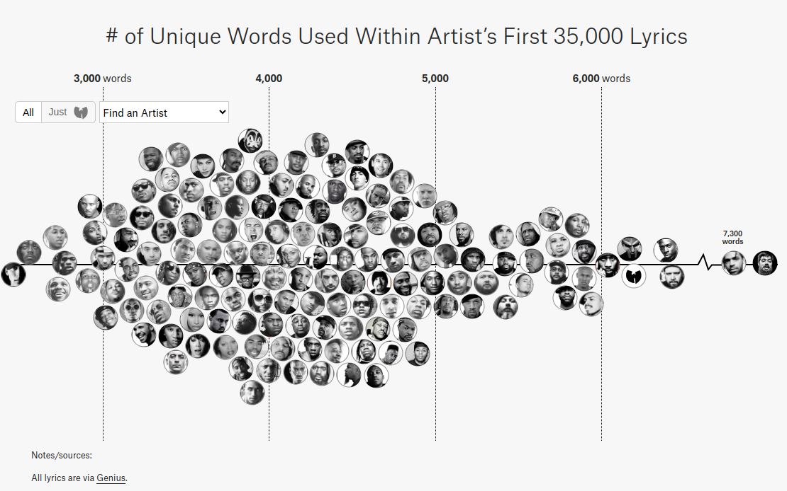

# Rapper Vocab Analyzer

[[toc]]

## Ideas

- Fan Out Architecture
- DDD
- unit testing
- That vocab analyzer site (screenshot)
- Services used (AWS Lambda, SQS, Serverless) contrast with k8s
- TLS cert? Kinda hard to do with serverless
- Automating deployment was kinda hard
- Response times due to warmup

## Introduction

<iframe style="border-radius:12px" src="https://open.spotify.com/embed/track/7fXPWrFoxtEGnoxu67ZjQa?utm_source=generator&theme=0" width="100%" height="152" frameBorder="0" allowfullscreen="" allow="autoplay; clipboard-write; encrypted-media; fullscreen; picture-in-picture" loading="lazy"></iframe>

There exists a peculiar link between Hip Hop music and me starting my journey as a programmer which I would like to expand on before getting into the gritty details of the project resulting from a chain of events that were set in motion more than a decade ago.
I've been a big fan of Hip Hop music ever since discovering Eminem when I was around 10 years old.
I still remember listening to his first albums on my CD player while diligently reading the lyrics to every song until I had memorized entire albums by heart - a habit I still have to this day.
At the time, I was far from being a proficient English speaker, so I had to look up a lot of the words and even knew some only by their phonetics.
I don't quite know what it was, but something had sparked my interest in both the English language and lyrics in general. Some years later, after having finished school, after having discovered plentiful other artists and after having gone through the same process of obsessing over their work, I found a [website](https://pudding.cool/projects/vocabulary/index.html) ranking rappers by their vocabulary.

Lo and behold, my favorite rapper at the time, Aesop Rock, was at the top of the list with a whopping 7,879 unique words used throughout his songs. If you know you know - no surprises there. However, some of the artists I was listening to at the time didn't appear at all.
Consequently, I did the only thing any reasonable person with a little too much time on their hands would do: I started to learn Python, the goal being to write a [script](https://github.com/4350pChris/LyricAnalyzer) to scrape the lyrics of artists I was listening to and run the same analysis on them.
During that time I realized - I really dig programming.

The project I will be talking about is my attempt at rewriting the aforementioned script in a more modern fashion, using the tools I have learned over the past few years.
Who would've guessed that a simple 100 LoC script could be blown up to a 4,500 LoC project involving multiple cloud services?

Well, I did. So that's exactly what I did. Now let's get to it.

## The Setup

<iframe style="border-radius:12px" src="https://open.spotify.com/embed/track/7lPJ5PrQnQRurUZIzMCQib?utm_source=generator&theme=0" width="100%" height="152" frameBorder="0" allowfullscreen="" allow="autoplay; clipboard-write; encrypted-media; fullscreen; picture-in-picture" loading="lazy"></iframe>

First off, let's talk shortly about the tools I used to build this project and why I chose them.
One thing to be said for the infrastructural decision making process is that on one hand I was trying to have a look at services I hadn't used before, while on the other hand I had to keep within the limits of the free tier of AWS, as I didn't want to spend any money on this project.
Some of them I will go into more detail later on, but for now, let's just have a quick overview.

### Code

I was torn between using [Go](https://golang.org/) and [Rust](https://www.rust-lang.org/) for this project, as I had been wanting to learn both for quite some time. However, I decided against it, as I wanted to focus on the cloud services and not on learning a new language.
Therefore I decided to go with [TypeScript](https://www.typescriptlang.org/), as I'm quite familiar with it and like it a lot.
In terms of code structure I wanted to try out [Domain-driven Design](https://en.wikipedia.org/wiki/Domain-driven_design), as I had never used it before and it seemed like a good fit for this project, as it tends to lend itself better to a microservices approach than other architectures.
While this isn't a microservices project per se, I figured I might as well give it a shot to see how it works out.

### Hosting the Backend - K8s vs Serverless

Since one of the prerequisites for this project was to use some sort of cloud service, I had to choose between writing a more traditional application and deploying it to a Kubernetes cluster or using a serverless approach.
I had already worked with Kubernetes in the past and, while I do like it a lot, I wanted to use this project as an opportunity to learn something new, as I had never written a proper serverless application before, which is why I decided to go with the latter.

### Lambda Deployment

The next step was finding a way to deploy my application to the cloud. I had seen the horrors of ~~war~~ manually deploying lambda functions in blog posts pretending that this was a-okay and decided I would have none of that.
Out of the box, AWS offers a way to deploy lambda functions using CloudFormation via [SAM](https://aws.amazon.com/serverless/sam/), but I didn't want to lock myself in too much, plus I had heard a lot of good things about the [Serverless Framework](https://www.serverless.com/) and decided to give it a shot.
Another option would've been [Terraform](https://www.terraform.io/), but I had already used it in the past and wanted to try something new.

### Website Deployment

For the website, I decided to stick with Serverless as well and integrate the deployment into the same pipeline as the backend.
For something so simple, this was surprisingly hard to do, but more on that later.

### Message Queues

Since I was quite sure I wouldn't want to do all of the work in a single lambda function, I needed a way to communicate between them.
For this, I decided to use [SQS](https://aws.amazon.com/sqs/), as I had already commited to using AWS and this seemed like the way to go.
I had also considered using [SNS](https://aws.amazon.com/sns/), but decided against it, as I didn't see the purpose at the time. This proved to be a mistake, albeit one that was quite straightforward to fix, as I will explain later.

### Database

For the database, I decided to go with [DynamoDB](https://aws.amazon.com/dynamodb/), mostly because I wanted to try it out and it seemed like a good fit for this project as there will be no complex relations and the data model is quite simple.
Other options like RDS I had already used in the past, and their pricing model, while still covered by the free tier, seemed less generous than that of DynamoDB.

## Enter The Cloud (36 Layers)

<iframe style="border-radius:12px" src="https://open.spotify.com/embed/album/3tQd5mwBtVyxCoEo4htGAV?utm_source=generator&theme=0" width="100%" height="152" frameBorder="0" allowfullscreen="" allow="autoplay; clipboard-write; encrypted-media; fullscreen; picture-in-picture" loading="lazy"></iframe>

Now that we've talked a little about the tools used, let's get into the gritty details.

### The Backend

For the backend, I decided to go more or less full-on DDD. This first involved a lot of reading both on the topic of DDD itself and code implementing its proposed patterns.
I tried to follow hexagonal architecture which also proved to be not quite straightforward. All in all I would say this requires a different style of thinking about structuring your code from the one I was used to, which was both challenging but also quite fun.
I ended up having four different layers: 

#### The Domain

The domain I ended up with is a quite simple one, consisting of a single aggregate root, the `Artist`, which contains a list of `Songs` and the calculated `Stats` for the artist. As I wanted to avoid having a, so called, "anemic domain model", I decided to make the `Artist` responsible for calculating its own stats, which is why it contains a reference to its `Songs` and not the other way around. However, I achieved a decoupling of the entity and the logic by using a `StatsCalculator` interface which is implemented by a class which is, in turn, injected into the `Artist` by its accompanying `ArtistFactory`.

Quite a lot of abstractions already at this point for something so simple, but that seems to be the point in this case as it does allow for quite a lot of flexibility.
Also, I meant to go a little overboard on this, just to see what happens.

#### The Application

This is where it gets a little interesting. I modeled this layer around `use cases`, which all contain an `execute` method.
I did this because I initially intended to use CQRS, which I ended up not doing, but I still found this unified method name to be quite nice as the class name itself already carries the semantics of the operation.
In general, use cases return either DTOs or nothing at all. This is because I wanted to make the layer that calls these use cases not have to bother with the domain model.

These use cases dictate what functionality would need to be implemented by the infrastructure layer.
That is, anything involving any of the mentioned services like storage, the message queue or downloading lyrics.

A thing that I needed some time to come to grips with was the fact that use cases have to be triggered in a specific order - however, they can't really invoke one another as this would lead to a single lambda function doing all the work.
In order to achieve the needed decoupling, I opted for firing integration events whenever a use case finished, which in turn trigger the next lambda function in the chain. That way I could theoretically scale each use case differently e.g. the one that does the downloading or parsing, which brings me to the next layer.

#### Infrastructure

At first I was using a single queue to handle all events, as there are what AWS calls `filters` which allow selecting events according to certain fields in the message.
In my case there's `eventType` which is a string that denotes the event that was fired and could therefore be used to select the correct event from the queue.
Now, this led to a peculiar thing to happen (for the uninitiated, at least) - jobs would execute only sometimes.
Other times they would simply vanish into the void. But why? Well, after *hours* of troubleshooting (no kidding) I finally found the section in the docs that explained what was happening.

::: info
If a lambda receives an event and the filter does not match, it silently discards the received message.
:::

This subverted my initial expectation that these messages would simply be passed over silently, staying in the queue for the correct handler to pick them up.

So my first solution was to use a separate queue for each integration event.
However, upon reflecting a little on this I came to the conclusion that this was highly unwieldly - I would have to add a queue in the `serverless.yaml` every time I wanted to implement a new type of event and I didn't seem to find a nice way to have no duplicate code when it came to handling and firing events.
I felt like a single queue *is* the best abstraction, as we want *one* message bus for the application.
This is what I had alluded to earlier - the solution to this is to use an SNS topic and have queues subscribe to it.
In contrast to SQS, SNS does not delete messages from the topic in this instance, as it does not care about subscribers not caring for a particular topic and will simply send events to all subscribers that are interested in the current message.
While this technically still requires separate SQS queues for each event, I found these to lend themselves much better to the way Serverless' configuration works.

Apart from this, there isn't anything too interesting about the infrastructure layer.
It implements a repository to fetch the artist from DynamoDB, a service to fetch lyrics from the [Genius API](https://api.genius.com), a service to fire the aforementioned integration events using SNS and other things which mostly act as glue between the domain and the actual data structures which are stored in the database or sent via queues.

#### Presentation Layer

Last but not least, there's a separate layer which represents the API.
While this could also be integrated into the infrastructure layer I felt like a separate folder might be suited better as this involves quite a lot of glue code, e.g. for validating input data for events or HTTP requests.
Moreover, this is the part of the application that actually utilizes the use cases from the application layer.
If this part were in the infrastructure layer I feel the resulting bidirectionality of dependencies, i.e. the application layer using repositories from the infrastructure and the infrastructure importing use cases from the application layer, might lead to confusion or even circular dependencies.
